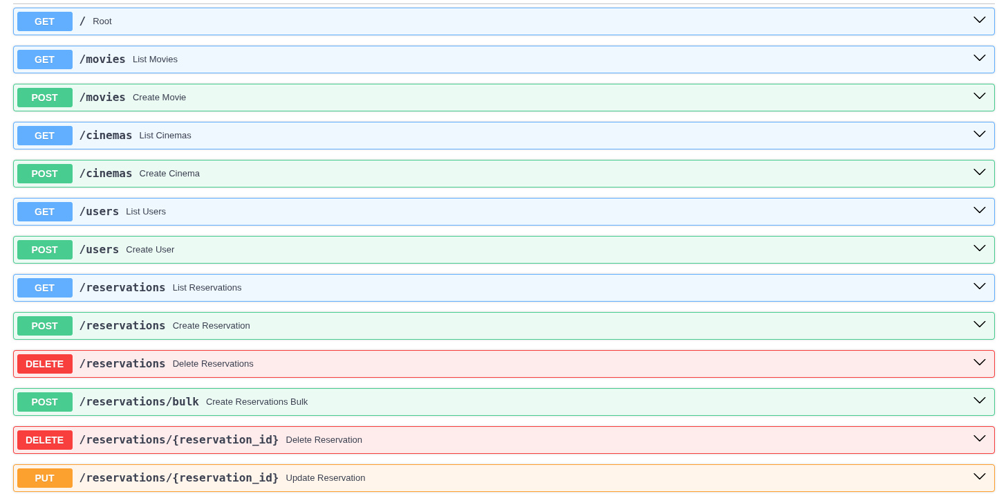
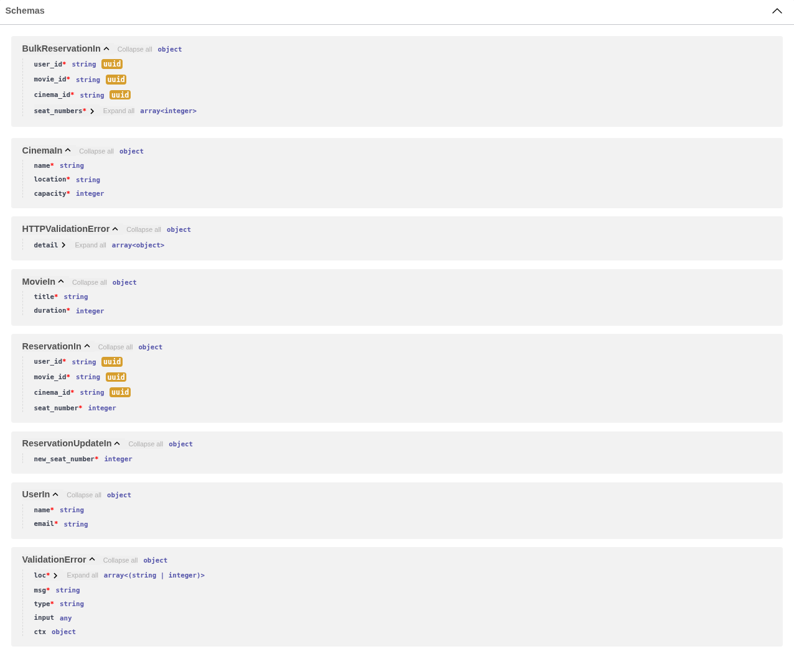
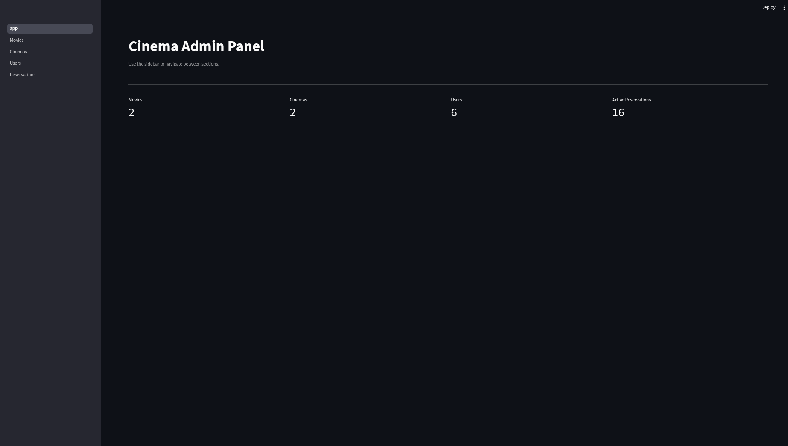
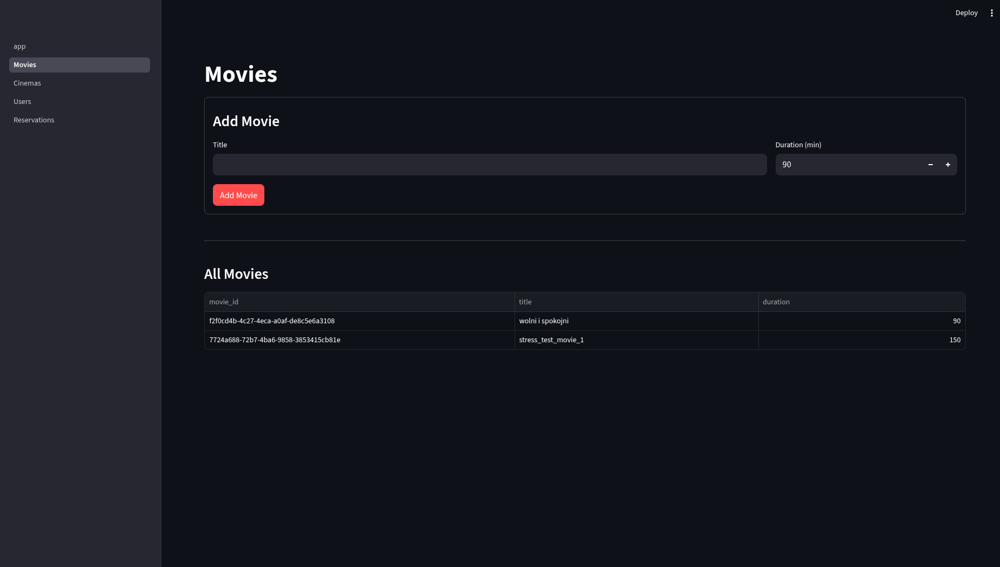
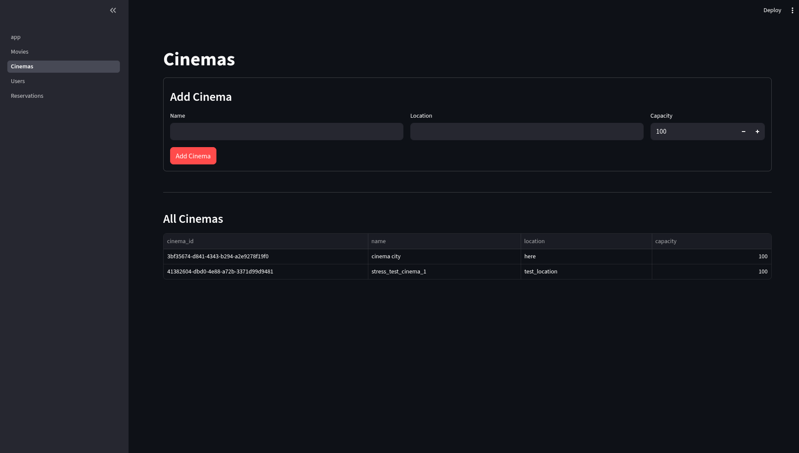
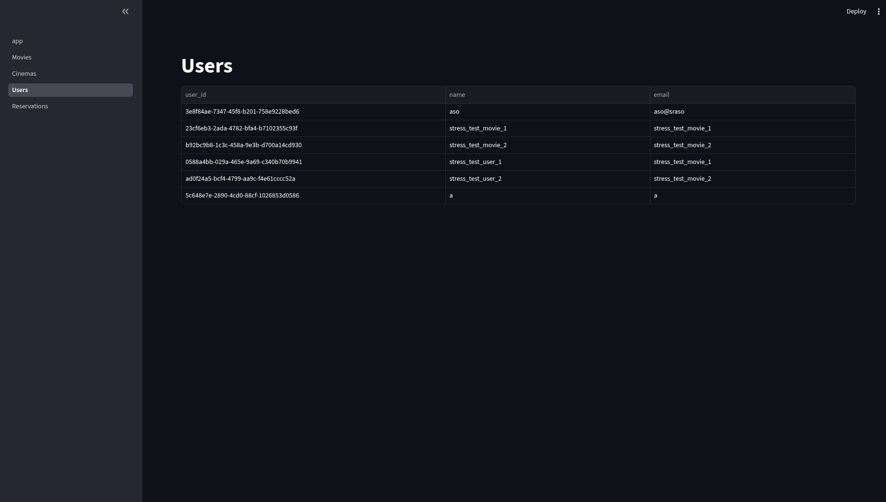
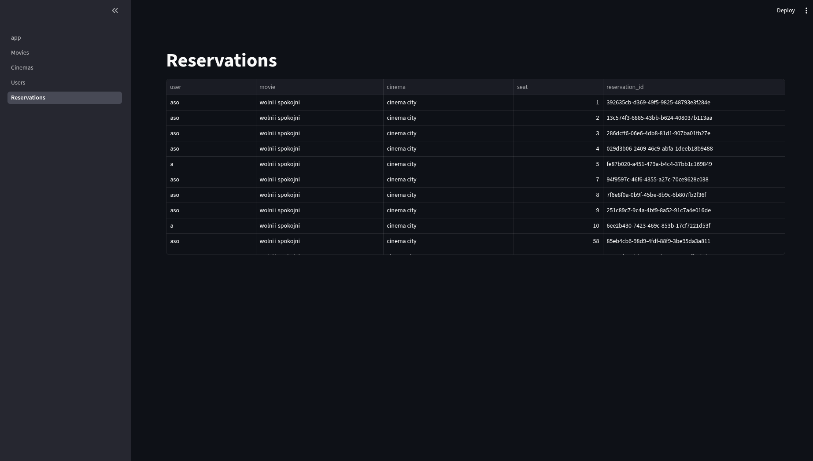
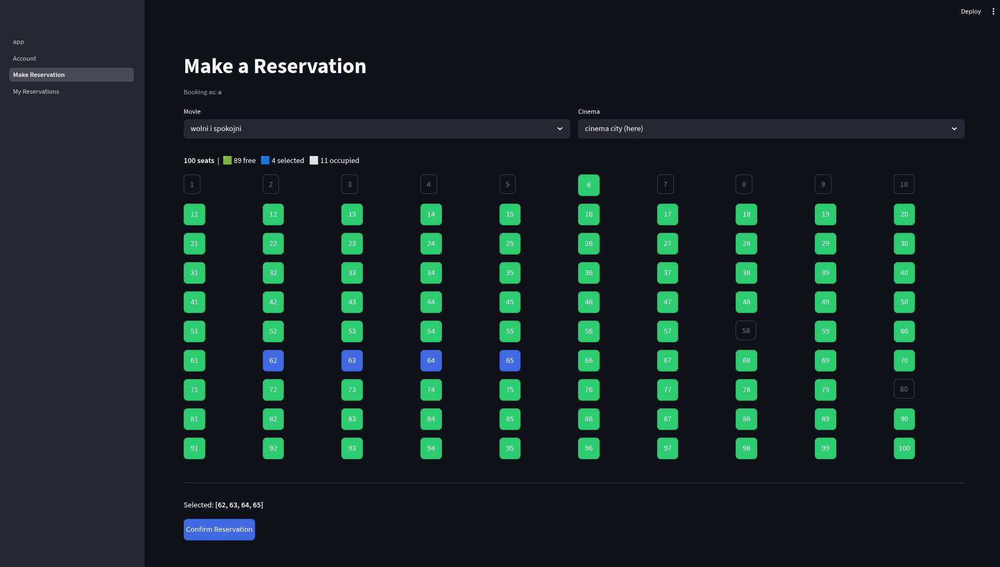
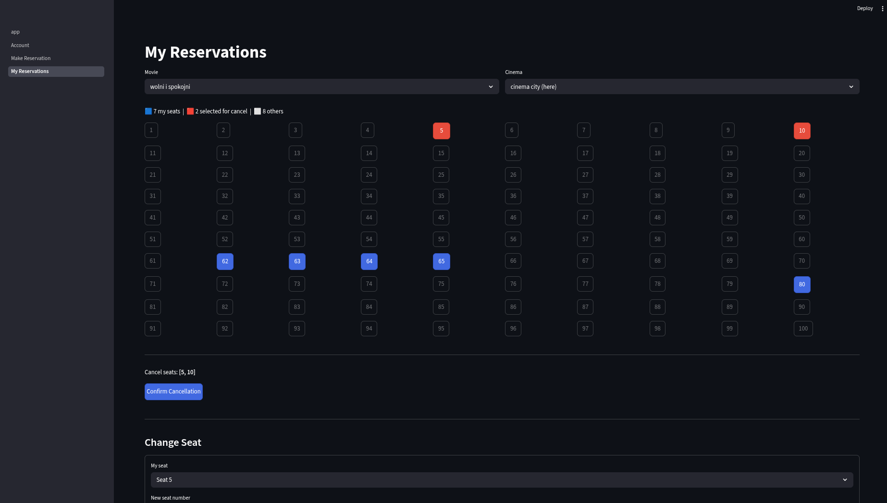

# project report
## backend 
### description

We used FastAPI to build the backend API, which provides endpoints for managing movies, cinemas, users, and reservations. The backend was designed to be modular and easy to test. We created an abstract class called `Database` that defines the interface for all database operations, and implemented a concrete `InMemoryDatabase` for testing and a `CassandraDatabase` for production use. This separation allows us to quickly test the API logic without needing a live Cassandra instance, while still ensuring a scalable and robust database layer for real-world usage.

### database structure

The database schema consists of five tables:
- `movies` — stores movie information (id, title, duration).
- `cinemas` — stores cinema information (id, name, location, seat capacity).
- `users` — stores user information (id, name, email).
- `reservations` — stores reservations with a composite primary key of (movie_id, cinema_id, seat_number) to prevent double-booking via Cassandra's lightweight transactions.
- `reservations_by_id` — a reverse-lookup table that maps reservation_id to its corresponding movie_id, cinema_id, and seat_number, enabling efficient reservation management by ID.

## frontend

The frontend is divided into two separate Streamlit applications: an **admin panel** for managing the system and a **user panel** for browsing movies and making reservations.

### admin

The admin panel opens on a dashboard that displays live counts of movies, cinemas, users, and active reservations. It has four subpages:

- **Movies** — add a new movie by entering its title and duration. All existing movies are displayed in a table below.

- **Cinemas** — add a new cinema with a name, location, and seat capacity. All existing cinemas are listed in a table.

- **Users** — view a table of all registered users.

- **Reservations** — view all reservations across the system with human-readable labels (user name, movie title, cinema name, seat number, reservation ID).

### user

The user panel requires logging before any booking action is available. It has three subpages:

- **Account** — log in with an email address or register a new account with a name and email. The session is stored in Streamlit session state and a logout button is provided.
- **Make Reservation** — select a movie and a cinema, then pick seats from an interactive visual grid. Free seats are shown in green, currently selected seats in blue, and already occupied seats are greyed out and disabled. Multiple seats can be selected at once and confirmed as a bulk reservation in one click.

- **My Reservations** — displays the user's seats for a selected showing in the same grid layout. Seats can be clicked to mark them for cancellation (highlighted in red), then cancelled all at once. There is also a form to change an existing reservation to a different seat number.

## stress test 
The stress test suite (`stress_test/test_reservations.py`) is written with `unittest` and uses Python's `threading` module to simulate concurrent HTTP clients hitting the FastAPI backend. Before all tests run, a dedicated cinema (`stress_test_cinema_1`, 100 seats), movie, and two users are created if they do not already exist.

**Stress test 1 — rapid same-seat race.** Thirty threads simultaneously try to reserve the same seat for the same user. The test asserts that exactly one request succeeds and the rest are rejected, verifying that Cassandra's `INSERT IF NOT EXISTS` LWT works correctly under rapid concurrent load.

**Stress test 2 — random concurrent clients.** Two users each make 100 reservation requests in parallel, each picking a random seat from the full 100-seat capacity. After all threads finish, the test checks that no unexpected HTTP errors occurred, that average response latency is below 500 ms, and that the database contains no double-booked seats.

**Stress test 3 — two users race for all seats.** Both users simultaneously attempt to bulk-reserve all 100 seats. The test asserts that there are no overlapping seats between the two users, that the total number of successful reservations equals the cinema's capacity (all seats claimed), and that neither user ended up with zero seats — verifying fair interleaving under bulk concurrent writes.

**Stress test 4 — continuous reserve and cancel.** Two bots each run 100 iterations of picking a random seat from a small 5-seat pool, attempting to reserve it, and immediately cancelling it if successful. After all threads finish the test checks for unexpected HTTP errors and verifies there are no double-booked seats remaining, exercising the full reserve/cancel cycle under contention.

**Stress test 5 — bulk cancellation.** One user books all 100 seats via a single bulk reservation call, then all reservation IDs are sent in one bulk delete request. The test measures elapsed time, asserts the delete succeeded, and confirms that no reservations remain for that showing afterwards.

## problems

1. **indexing problem**
    
    Due to a miscommunication, the backend originally used 0-indexed seat numbers (seats 0–99) while the frontend used 1-indexed seats (seats 1–100). This caused silent mismatches where a seat selected in the UI did not correspond to the seat stored in the database. The inconsistency was caught by the stress tests, which revealed thatit is impossible to reserve all seats in cinema (there was no option to reserve set with the highest number). All seat numbering was subsequently unified to 1-indexed throughout the backend and frontend.

2. **stress test 3**
    
    Stress test 3 requires that when two users simultaneously try to bulk-reserve all seats, both end up with a non-zero share. With a deterministic insertion order, one user's requests would consistently win all seats near the front of the list while the other user's requests arrived slightly later and found everything taken. To prevent this, the backend now randomly shuffles the seat list before processing a bulk reservation, so neither user has a systematic advantage and seats are distributed roughly evenly between concurrent bulk requests.

3. **schema problem**

    The original schema stored reservations with `reservation_id` as the primary key. This meant that preventing double-booking required a `SELECT` followed by an `INSERT` — two separate operations with a race condition between them. Two concurrent requests could both read the seat as free and both insert successfully, producing a double booking.
    The fix was to restructure the `reservations` table so its primary key is `((movie_id, cinema_id), seat_number)`, making the physical seat position the unique identifier. Combined with `INSERT IF NOT EXISTS`, this becomes a single atomic Cassandra lightweight transaction (LWT): only one of two racing inserts for the same seat can be applied, and the other receives `applied = false`.

    Because it is no longer efficient to look up a reservation by its UUID with the new partition key, and to prevent adding `allow filtering`phrase, a second table `reservations_by_id` was added as a reverse-lookup index — a standard Cassandra denormalization pattern. The `change_reservation` operation was also rewritten to use the same LWT approach: it atomically inserts the new seat with `IF NOT EXISTS` first, then deletes the old one, preventing races during seat changes as well.

4. **uv problem**

    During development the project's dependency setup became inconsistent — multiple conflicting virtual environments and lock files accumulated. This was resolved and the project now uses `uv` as its sole package manager. `uv` reads dependencies from `pyproject.toml`, resolves them deterministically into `uv.lock`, and installs them into a managed virtual environment with `uv sync`. All commands are run through `uv run`, which automatically uses the correct environment without manual activation.

4. **possible improvements**:

- The current authentication model is minimal: login is done by email only, with no password and no server-side session. There is also no access control — both the admin panel and the user panel are open to anyone who has the URL. In a production deployment this would need proper password hashing, session tokens, and role-based access restrictions. These features were intentionally not implemented as authentication and access control were outside the scope of this project, which focused on the distributed database layer.

- Several features would be needed before this could serve as a real reservation system. Most notably, screenings need a date and time — currently a movie and cinema pair implicitly represents a single showing, so two screenings of the same film in the same cinema are impossible to distinguish. Cinemas could also be extended with named rooms so that one venue can have multiple screens. On the operational side, bulk cancellation does not currently return per-seat results, making it harder to diagnose partial failures. Bulk cancellation currently is not a real bulk operation, it consists of multiple single seat reservations in a loop, making the system slower.